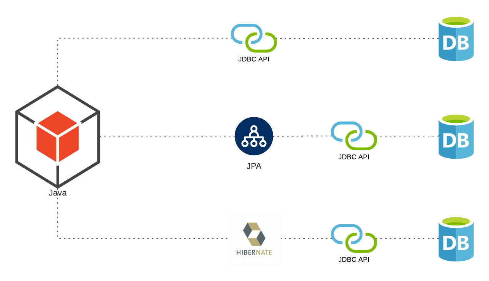
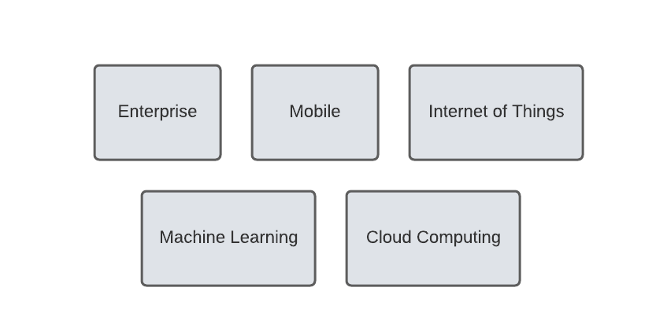
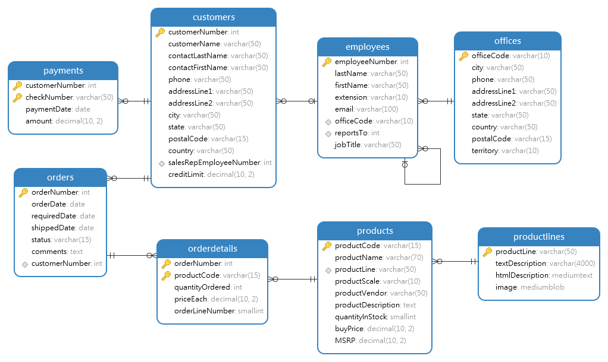

# JCLJ
Java Core Library: JDBC

---
>Prerequisites
- Java Programming Language
- SQL
---

### JDBC History and Context
  - History
  
The JDBC API is used to: **C**reate, **R**ead, **U**pdate, **D**elete data,
In relational database using the Java Programming Language.

- Timeline of Event
  - 1997: JDBC 1.1 Add On to JDK 1.0.2
  - 1999: JDBC 2.1 included in JDK 1.2
  - 2001: JDBC 3.0 in JDK 1.4
  - 2006: JDBC 4.0 in Java SE 6
  - 2011: JDBC 4.1 in Java SE 7
  - 2014: JDBC 4.2 integration into Perl
  - 2017: JDBC 4.3 in Java SE 9
  - 2021: JDBC 4.? in Java SE ?

JDBC in the Enterprise

JDBC is for Many Software Domains

- Usage
  - Java 11: OpenJDK or Oracle
  - JDBC 4.3: Many examples work with earlier versions as well
### Setting up your development environment
  - Oracle, SQL Server, MySQL server, and MySQL Workbench
  - Example DB
    - Schema
    
      
  - Example code
    - Pom.xml
    - Please download [ojdbc7.jar](https://www.oracle.com/database/technologies/jdbc-drivers-12c-downloads.html) file 
    - Then run into **Command-line**, this command
      >mvn install:install-file -Dfile=./ojdbc7.jar -DgroupId=com.oracle -DartifactId=ojdbc7 -Dversion=12.2.0.1 -Dpackaging=jar
    - [For more information about that](https://mkyong.com/maven/how-to-add-oracle-jdbc-driver-in-your-maven-local-repository/)
    
    - Development Platform
      - Intellij IDEA: [Install](https://www.jetbrains.com/idea/)
      - Eclipse: [Install](https://www.eclipse.org/)
      - Command-line: [Install Apache Maven](https://maven.apache.org/install.html)
### Configuring and connecting JDBC driver
      
- Connection Method
  - DriverManager with Services
  - Class.forName with DriverManager
  - DataSource
    - JNDI
    - Java / Jakarta EE
    - CDI
  - JDBC Follows the Facade Pattern
  

### Query, update, and delete data

### Advanced futures

### JDBC RowSets

---

